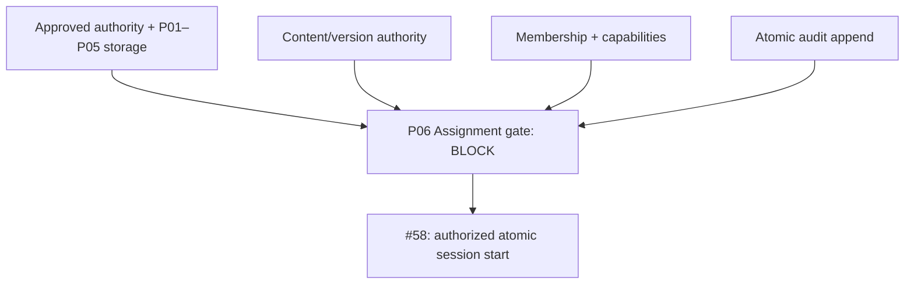

# Whole-repository integration audit — 2026-10-04

Audited baseline: `045114b9a211bce4485f7d3acd88230e8448e1e9`; remote tree `91fadc8a29648e6f14e10460f292b3ec8f579c4f`. All 323 baseline file contents and modes were reconciled before authoring this repair. Exact baseline main CI was 22/22 green. The wider standalone inventory was **42/43 PASS**; therefore that green subset did not prove every repository gate.

Scope: all authority registries and validators, active contract requirements, ownership/architecture/Application/Persistence alignment, all implemented module sources and ports, all five migration snapshots/journal entries, current implementation evidence, workflows, future-slice queue, and open implementation issues. Runtime/deployed conformance is UNKNOWN where no authoritative runtime/production proof exists. This is a source and evidence audit, not an independent external review.

| Finding | Evidence at baseline | Repair / gate |
| --- | --- | --- |
| Historical validator rejects later approvals | `validate-persistence-semantic-closure-registration.mjs` fails on CredentialId, AssignmentId, ProgressEventId; its output also reports stale K00/counts | Preserve issue #17 history and require issue #46 later promotion provenance; run every standalone validator unconditionally |
| Arbitrary database execution while production is blocked | `db:migrate`, P01–P04 replay tools, and integration tests create Pools from unchecked DATABASE_URL | Guard all database entry points before connecting; test missing declaration, remote URL, administrative/shared/production database, query override and secret-safe errors |
| Future queue hides missing admission | P06/P07/P08 say READY with empty blockers; Assignment says three relationships, ProgressEvent says zero | GATE_REQUIRED/BLOCK, explicit false authoring permissions, exact live relationships: Assignment 2 / Certification 3 / ProgressEvent 1 |
| Credential port defined by Infrastructure | `CredentialRepository` interface resides inside the PostgreSQL adapter | Move unchanged port to Identity Application; enforce the direction across every adapter |
| Input scope/reference changes during lock waits | Older repository methods reuse caller-owned input after transaction/advisory/Identity lock awaits | Detach the complete input at each method entry, preserving Buffer/Date values; PostgreSQL tests mutate caller scope/key/Identity while a verified lock waiter exists |
| Regression fixture removes CI inventory | Scratch-copy filter excludes any path containing `/.git`, including `/.github` | Exclude the `.git` directory exactly; preserve workflow files and omit installed dependencies |
| Stale P03 tracker | #42 remains open while current admission and P03 implementation are proven | Reconcile issue state with exact merge/CI evidence; no new admission decision |

The repairs are tracked in [#59](https://github.com/peteywee/teach-v2/issues/59). Exact candidate/main proof is recorded there and in the repair PR after its gates complete. Existing source verification commits remain historical; this report does not rewrite them or claim their check counts apply to a later commit.

The approved framework is coherent: one mutable-fact owner, no foreign Infrastructure imports, no Domain database dependencies, no Application import of Infrastructure, exact eight-criterion schema admission, and immutable P01–P05 migration history. All physical totals remain **8/5/8/5**. K00 is 0.16.0, Ownership Map 1.7.0, Architecture/Application/Persistence authorities 1.0.0. K00 has 23 approved commands, 15 approved identifiers, 15 approved relationships, 7 approved state sets, and 7 approved state machines. Candidate semantics remain outside implementation authority; the capability registry is empty.

Physical proof does not complete these runtime obligations:

- C22 canonical provider readback and Application reconciliation wiring.
- C11/C12 authoritative authentication/authorization, Credential change and session revocation, and required audit boundaries.
- Application AcceptInvitation → Organization CreateMembership and OffboardIdentity → Organization RevokeMembership atomic orchestrations.
- C32 authoritative assigned-content authorization and atomic LearningSession start.
- C31 validated immutable content versions and Content-owned read interfaces.
- C33 authoritative manager/learner scope/capability checks and atomic Assignment audit.
- Approved transport, full runtime acceptance, and production backup/restore/configuration/release evidence.

The next dependency-ready work is the Assignment evidence plan and automated BLOCK evaluation. P06 currently has **4 PROVEN / 4 UNKNOWN** admission criteria. Issue [#60](https://github.com/peteywee/teach-v2/issues/60) owns the unresolved shape gate. ContentVersion is still candidate, content/version representation is unselected, protected membership/capability scope is unresolved, and Content/Audit adapters are absent. P06 creates no table, repository, migration, lifecycle state, capability, or runtime authorization.

Passing the P06 plan validator means the BLOCK decision is correctly recorded. Only a later complete ADMIT evaluation may authorize physical implementation. Required tests include two empty replays, P05 upgrade replay, exact-version binding, authoritative denial/no-write, atomic audit rollback, duplicate/contention policy, and authorization-plus-insert atomicity. Learning runtime and shared/production migration execution remain BLOCKED.
