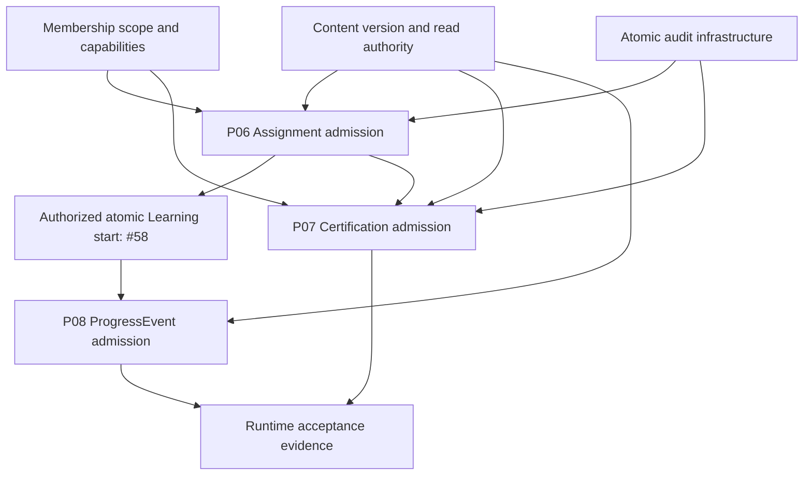

# Whole-repository coverage expansion

Baseline: exact remote `main` at `1c6065e1af5292abc2c8fdc75ee5a6e611b820bd`, tree `61653c16661d3e2d4e1545838f18a7ce18646bda`. The local synthetic checkout matched this tree. This batch builds on the complete repository audit in PR #61; it does not reset historical admission or migration evidence.

| Finding or missing dependency | Result in this batch | Proof and limit |
| --- | --- | --- |
| Invalid dates bypassed Domain session expiry comparisons | Deny with `INVALID_TIME`; Application lookup rejects invalid clock before persistence | Four Domain date cases and an Application zero-lookup case. This diagnostic is not a new persisted lifecycle state |
| Reconciliation input relied on SQL for invalid outcome/key-source/date rejection | Explicit runtime validation before any transaction | Seven negative Domain cases; registered values and retention policy unchanged |
| Reconciliation storage lacked provider readback orchestration | Application-owned `ExternalProviderReadbackPort` and `reconcileExternalEffect` service | Canonical success/no-effect resolve, unavailable/malformed/throw preserve OPEN, terminal replay performs no read/write, errors are redacted, no send/retry port. Unit doubles and PostgreSQL service tests do not prove a real canonical provider adapter |
| P03 Application issuance/consumption had no dedicated unit suite | Dedicated verifier-only issuance, owner scope, malformed-secret and failure/no-retry cases | Fourteen cases; membership creation and Credential change atomicity remain absent |
| Mutable caller objects were tested at only two lock seams | P02 session and all three P03 creation adapters exercised during actual PostgreSQL lock waits | Identity, verifier Buffer and Date remain original; inactive owner redirection cannot create unauthorized rows |
| Expiry persistence failures and rollback were under-covered | Failed lazy token expiry still denies; failed Credential revocation and Learning completion leave rows unchanged | Real temporary fault triggers in isolated PostgreSQL only |
| Low contention or missing terminal race proofs | 16-way Invitation/SetupToken/PasswordResetToken use, Credential revoke and conflicting reconciliation resolution | Single-use/revoke winners and one terminal canonical outcome; P05 existing 16-way completion preserved |
| P02 race proof inferred blocking from a fixed sleep | Shared bounded helper observes `pg_blocking_pids` before releasing the lock | Actual database blocking, three-second failure bound |
| P07/P08 had no evidence plan or automated admission evaluation | Each has separate plan and exact eight-criterion BLOCK evaluation: four PROVEN, four UNKNOWN | Fourteen positive/negative gate cases; no semantic promotion or physical authoring |
| Approved commands could disappear from integration reporting | Exact 23-command source/test/authority ledger | Twelve PARTIAL, eleven BLOCKED, zero full-runtime conformance claims; eight ledger regressions |
| New shared changes could skip physical slice workflows | Every P01–P05 workflow runs on every PR/main tree | Path-filter regression; PostgreSQL, replay, frozen dependencies and typecheck steps preserved |
| Future artifacts could hide in an existing module/migration/snapshot | Whole audit rejects recognizable future physical tables across all module schemas and migration/snapshot inventory | Three different artifact mutation cases; static scans are supplemental, not proof of arbitrary-code behavior |

All new standalone validators have clean positive and mutated negative cases. The whole-repository runner now executes **48 standalone validators**. Validator regressions total **180**. Domain/Application suite total is **100**, including the new reconciliation foundation; PostgreSQL suite total is **61**. Pinned Node 20 / frozen pnpm and PostgreSQL 17 workflow logs, exact source SHA, scope and review state are recorded on the PR after execution. Local dependency-free gates and Node 24 stripped-type foundation checks supplement those logs and do not replace pinned typechecking.

No contract, kernel entry, owner approval, Architecture/Application/Persistence authority, P01–P05 admission/implementation evidence, migration, snapshot, lockfile or readiness record is changed. Inventory remains **8 tables / 5 migrations / 8 repositories / 5 physical slices**. Full runtime conformance is UNKNOWN; runtime activation and shared/production execution remain BLOCKED.

## Dependency order for the next batch

These are dependency gates, not a requirement to implement Certification before ProgressEvent. The queue's planned upgrade checkpoints record P06→P07→P08; any reorder requires updating its evidence plan before physical authoring.

| Decision/dependency | Controlling authority | Required concrete closure |
| --- | --- | --- |
| Assignment physical shape | #60; C31/C32; Persistence Model | Requiredness and target/version encoding, lifecycle or explicit no-lifecycle decision, mutation/immutability, uniqueness/replay policy, protected scope fields |
| Content version | C31 OQ-CNT-1; candidate ContentVersion | Select the canonical version representation and register/promote it before physical use; define owner-read facts and immutable published identity/version |
| Membership and selected scope | C13 OQ-TEN-1/2 | Select single-location compatibility or normalized multi-organization/location model and exact explicit scope selection mechanism |
| Capability vocabulary | C14 OQ-AUTHZ-1; currently empty capability registry | Approve vocabulary/bundles; default-deny registry and ordered current-fact checks need exact approved names |
| Atomic audit | C23; APP-7 | Audit record admission, append-only enforcement and same-transaction adapter; retention gate OQ-AUD-1 remains explicit |
| Certification public/criteria shape | C34 OQ-CERT-1/2 | Public/private boundary, exact fields and criteria approval authority/location before P07 admission |
| ProgressEvent payload and retry shape | C32 LRN-7/10; C22 | Exact event payload/version, explicit key source/horizon/retention and completion/append ordering; no invented mastery/XP/carryover rules |
| Provider reconciliation runtime | C22; ExternalProviderReadbackInterface | Real canonical readback adapter, authoritative backend scope and protected composition; foundation tests alone cannot close this |

Issue #60 remains the P06 shape gate; issue #58 remains the authorized atomic Learning runtime gate. P07/P08 admission records preserve their own unresolved authority instead of declaring READY. The next physical implementation may begin only after the relevant eight-criterion automated evaluation produces ADMIT.
